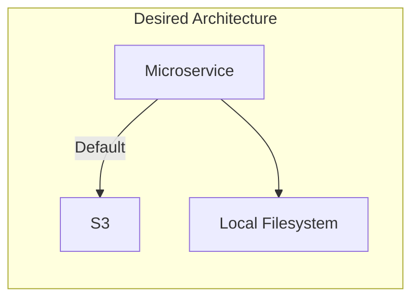

# AWS S3

In this exercise, we have a microservice that allows users to upload and download files associated with a user. The
current implementation stores files on the local filesystem, but this has some limitations. For example, if we want to
scale the microservice horizontally, we need to make sure that all replicas have access to the same files. Additionally,
if we want to add new servers to the infrastructure, we need to manually copy the files to the new servers.

To address these limitations, the project architect has decided to change the file storage to AWS S3. AWS S3 is a
cloud-based object storage service that provides a number of advantages over local storage, including:

Global availability: Files stored in S3 are available from anywhere in the world.
Scalability: S3 can be scaled to meet the needs of any application.
Durability: S3 provides high durability for your data.

To solve this problem, we need to refactor the code to support both implementations, S3 and local. By default, images should be stored in S3.


## Users
List of existing users in the database.

- id: 1f2d3e4c-5b6a-7d8c-9e0f-1a2b3c4d5e6f
- name: John Doe

---

- id: 9a8b7c6d-5e4f-3g2h-1i0j-9k8l7m6n5o4p
- name: Jane Smith

## Request

You can run this command in your command line interface to execute the transfer request using curl. Make sure that your
server is running on port 8000, and adjust the URL accordingly based on your specific setup.

*Upload a file*

```
curl -X POST -H "Content-Type: multipart/form-data" -F "file=@path/to/file.jpg" http://localhost:8080/upload/1f2d3e4c-5b6a-7d8c-9e0f-1a2b3c4d5e6f
```

*Get a file*

```
curl -O http://localhost:8080/image/1f2d3e4c-5b6a-7d8c-9e0f-1a2b3c4d5e6f/file.jpg
```