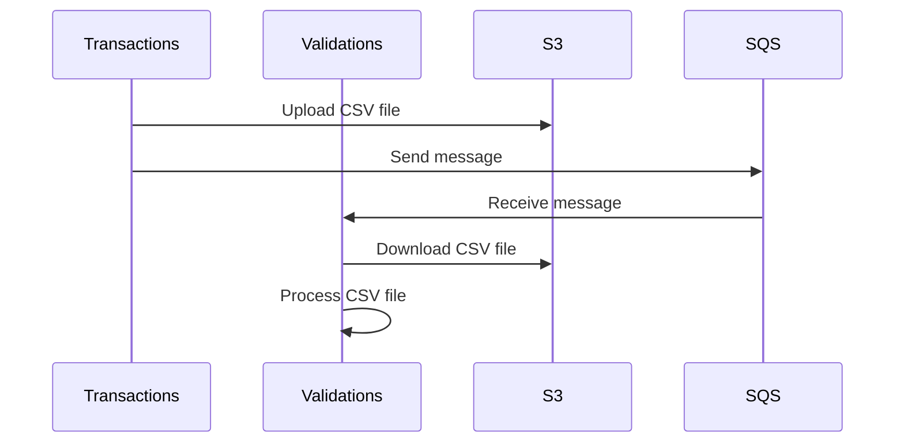

# AWS SQS
In this exercise, we will be working with two microservices: a transactions microservice and a validations microservice.
The transactions microservice exposes an endpoint that executes a synchronous process. The process consists of the
transactions microservice connecting to its database and creating a CSV file with all the transactions that need to be
validated. It then makes a call to the validations microservice to process the CSV.

One of the problems with this architecture is that the validations microservice can sometimes take a long time to
process the CSV. Since the entire process is synchronous, this can lead to timeouts or a poor user experience. The
validations microservice then sends an email notification to the user about the transactions that need to be reviewed
manually.

The architect has decided to change this synchronous communication to asynchronous communication. To do this, the
architect wants to introduce two AWS technologies to the system: S3 and SQS. The idea is that when the transactions
microservice creates the CSV file, it will upload it to S3 and then send a message to SQS indicating that a new file
needs to be processed. The validations microservice will then be listening for this type of message and will react
asynchronously. It will need to download the CSV file from S3 in order to continue processing it.

